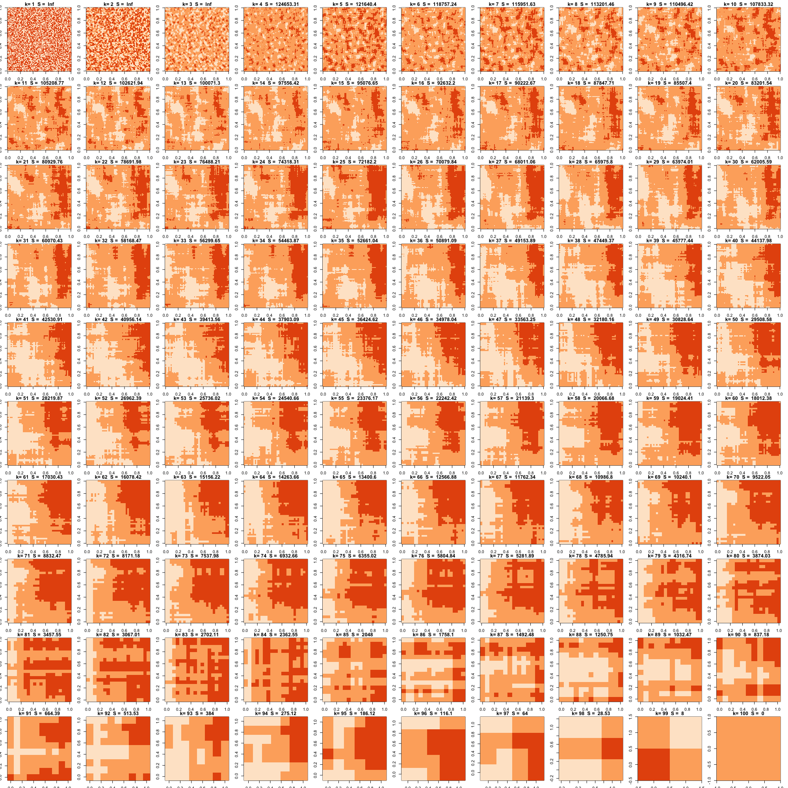

# Matrix entropy visualisation

R version of this python implementation of *Measuring entropy patterns of a 2d binary matrix* by William Huber using Mathematica at https://github.com/MarkEdmondson1234/matrix-entropy

It uses the concept of localised similarilty to try and give an intuitive visualisation on if a matrix is ordered (low entropy) or unordered (high entropy)

## Demo

k is the localarity level, S the measure of entropy.  Compare random and ordered grids of the same size, S should be higher (lower entropy) for more ordered boards. 

## Outputs

A random 100 binary matrix has `2^10^2 = 1.267651e+30` possible states. 



Chess board: S is 0.5 for all

```r
chess <- matrix(rep(c(rep(c(1, 0), 4), rep(c(0,1), 4)), 4), nrow = 8)


plot_ks(chess)
         1          2          3          4          5          6          7          8 
       Inf 33.9642118 25.1769039 17.3286795 11.1031651  6.2383246  2.7734219  0.6931472 
```


Random board: S is higher at all levels of neighbourhoods (k)

```r
my_matrix <- test_matrix(8)
plot_ks(my_matrix)

         1          2          3          4          5          6          7          8 
       Inf        Inf 23.4858626 14.4746664  9.2703745  5.5500607  2.4971547  0.6325226 
```


```r
m_lowest <- low_matrix(8)
plot_ks(m_lowest)
1 2 3 4 5 6 7 8 
0 0 0 0 0 0 0 0 
```

