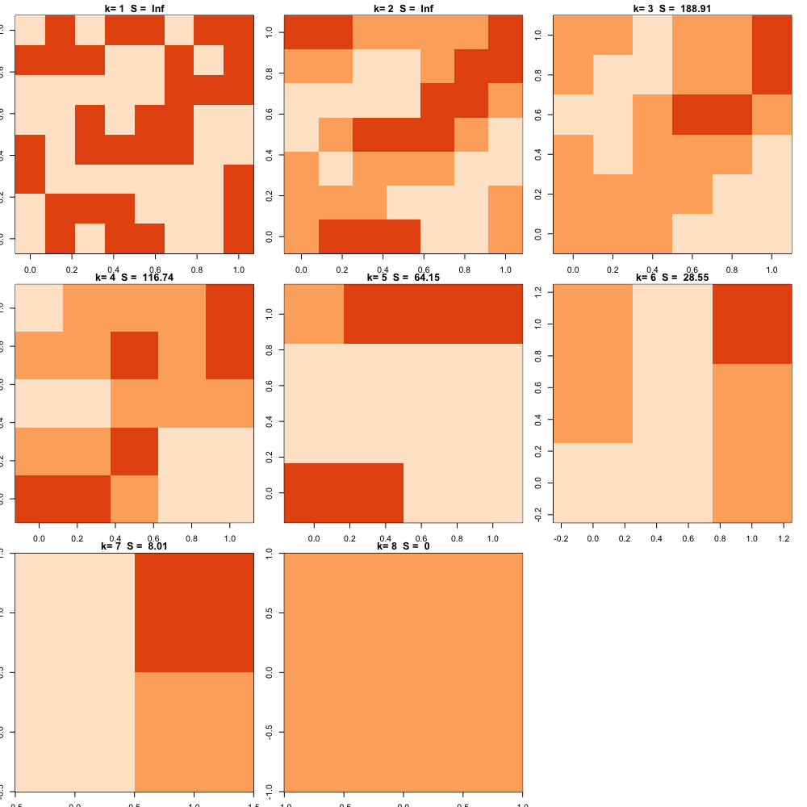

# Matrix entropy visualisation

R version of this python implementation of *Measuring entropy patterns of a 2d binary matrix* by William Huber using Mathematica at https://github.com/MarkEdmondson1234/matrix-entropy

It uses the concept of localised similarilty to try and give an intuitive visualisation on if a matrix is ordered (low entropy) or unordered (high entropy)

## Demo

k is the localarity level (size of grid that sums squares), S the measure of entropy, from Inf to 0.  Comparing random and ordered grids of the same size, S should be lower for more ordered boards at the interesting level of granularity.  For very small `k=1` its the same as the original matrix, for very large `k=N` everything averages out and no features are detected. 

## Outputs

A random 100 binary matrix has `2^10^2 = 1.267651e+30` possible states. 


Chess board:

```r
library(tidyverse)

chess <- matrix(rep(c(rep(c(1, 0), 4), rep(c(0,1), 4)), 4), nrow = 8)

plot_ks(chess)
         1          2          3          4          5          6          7          8 
       Inf 275.120782 186.439894 116.096405  64.018481  28.529325   8.001202   0.000000 
```


Random board:

```r
my_matrix <- test_matrix(8)
plot_ks(my_matrix)

         1          2          3          4          5          6          7          8 
       Inf        Inf 188.909173 116.743077  64.146206  28.551523   8.007139   0.000000 
```



```r
m_lowest <- low_matrix(8)
plot_ks(m_lowest)
1 2 3 4 5 6 7 8 
0 0 0 0 0 0 0 0 
```

## Order matrices by their entropy

```r
## order matrices
matrices <- map(1:10, ~ test_matrix(8))

matrices <- c(list(chess, low_matrix(8)), matrices)
matrices %>% 
   entropy_order %>% 
   map(plot_ks) %>% 
   reduce(bind_rows)

# A tibble: 12 x 8
     `1`      `2`      `3`      `4`      `5`      `6`      `7`   `8`
   <dbl>    <dbl>    <dbl>    <dbl>    <dbl>    <dbl>    <dbl> <dbl>
 1   384 275.1208 186.1173 116.0964 64.00000 28.52933 8.000000     0
 2   Inf 275.1208 186.4399 116.0964 64.01848 28.52933 8.001202     0
 3   Inf 279.6460 187.4087 116.4981 64.16405 28.58229 8.006634     0
 4   Inf      Inf 187.8563 116.5610 64.09985 28.55596 8.006550     0
 5   Inf      Inf 187.8862 116.4989 64.14305 28.58380 8.005273     0
 6   Inf      Inf 188.1581 116.7770 64.21957 28.54330 8.003946     0
 7   Inf      Inf 188.3452 116.8180 64.20474 28.62495 8.008562     0
 8   Inf      Inf 188.5185 116.4688 64.07459 28.58262 8.003717     0
 9   Inf      Inf 189.0656 117.1166 64.25140 28.54270 8.010158     0
10   Inf      Inf 190.1992 117.6576 64.56027 28.61353 8.004776     0
11   Inf      Inf 190.4175 117.9231 64.54452 28.67088 8.024770     0
12   Inf      Inf 190.9182 116.8171 64.15465 28.55809 8.003275     0
```

